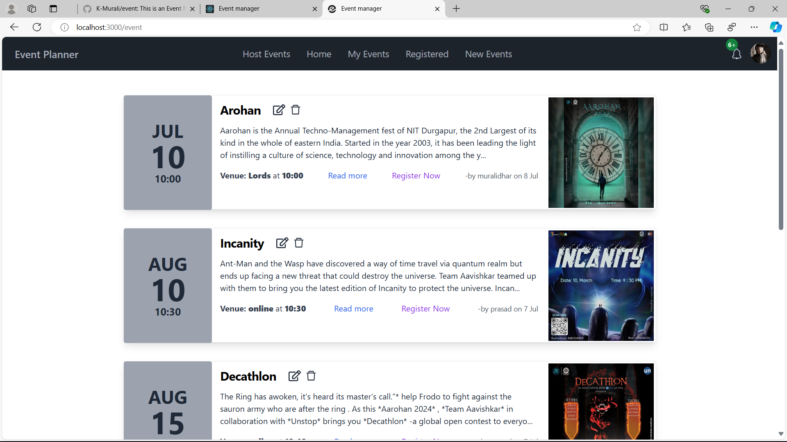
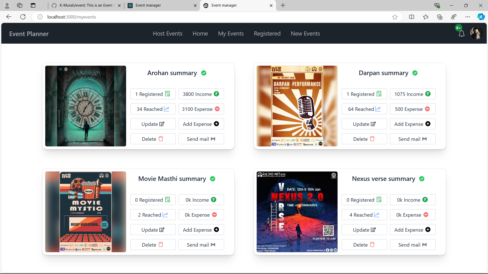
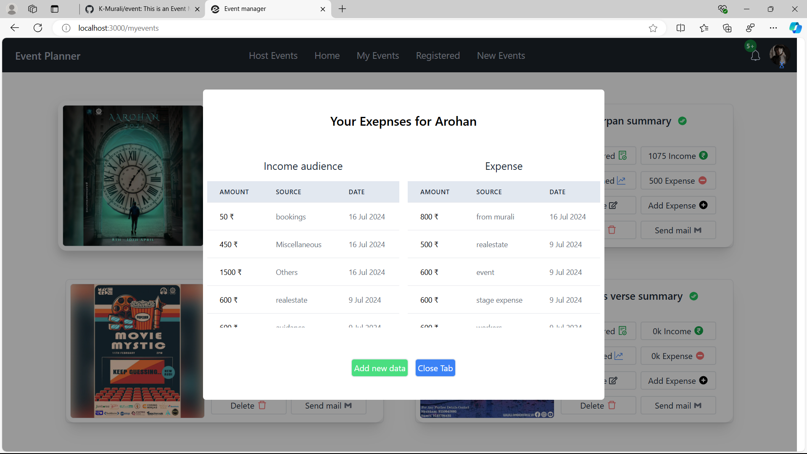
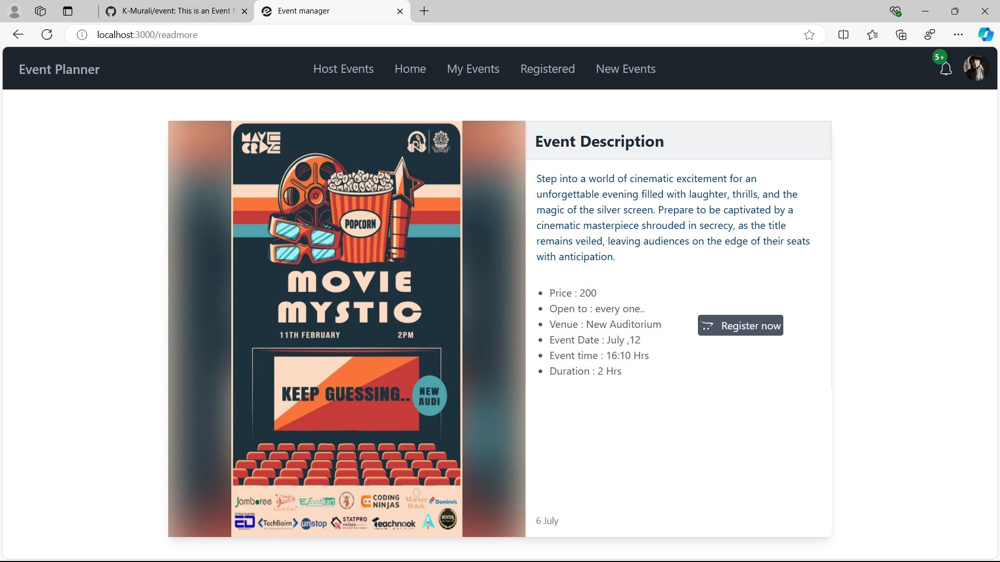
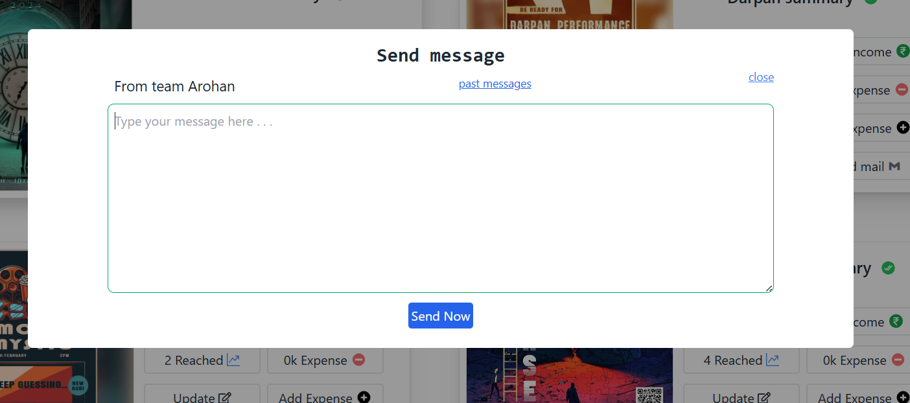

# Event Planner

## Table of Contents

- [Project Overview](#project-overview)
- [Installation](#installation)
- [Features](#features)
- [Screenshots](#screenshots)

## Project Overview

1. Event Exploration.

2. Event Registration.

3. Event Hosting.

4. Event insights.

5. Budeget tracking.

6. Audience Management.

## Installation

1. Download the zip folder.
2. Extract the folder.
3. Go to this location in your vscode terminal.
4. create your environment

## Features

1. Event Exploration\n
   Easily explore upcoming events with detailed information to help attendees make informed decisions.

2. Event Registration\n
   Simplify the registration process, offering a seamless and user-friendly experience for participants.

3. Event Hosting\n
   Provide essential tools and support for efficient event management and execution.

4. Event Insights (Reach and Registration)\n
   Gain valuable insights on event performance, including audience reach and registration metrics.

5. Budget Tracking for Events (Income and Expenses)\n
   Track event budgets accurately, managing income and expenses for financial transparency.

6. Sending Personalized Messages to Audience\n
   Send personalized messages to the audience, enhancing engagement and the overall event experience.

## Screenshots

    Home Page

    Event Insights

     
   Event expense

    Event detail page

    Event registrtion

    update box, message box

    Notifications

